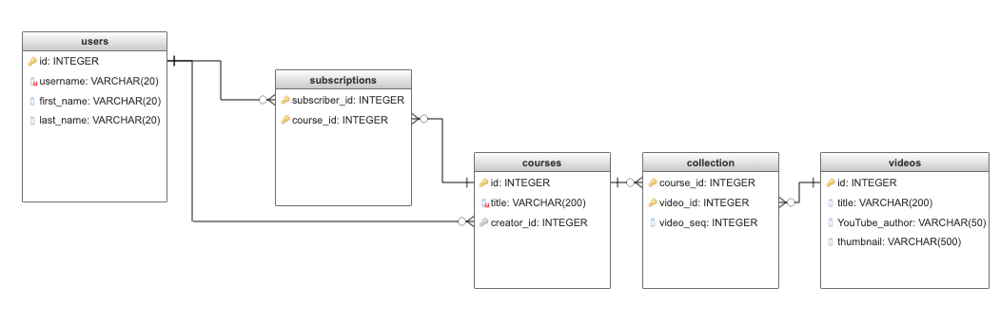

# Capstone Project 1 Proposal

**Goal**: Build a database-driven website from an API of my choice

## Website Goal

Users can design their own learning paths by curating sets of videos around a given topic area. The user can save a curated collection of videos from multiple YouTube presenters into a single course. The end result is similar to a course on Udemy or Coursera.

An important advantage of using this approach is that it is 100% free. Unnecessary gatekeeping happens when lower-income segments of the population are not able to access educational resources that could propel them forward.

## User Demographics and Learning Goals

### User Demographics

* Users are motivated learners and DIYers who want to find a free way to learn. 
* Some users may come from a low socio-economic status background and may not have a computer at home.
* Users could also include employers who curate a set of videos into a course for certain of their employees to consume.

### Learning Goals of Users
User learning goals can be related to just about anything that YouTube has a video about. 
Examples include: 
* Complete a coding bootcamp
* Test prep for college entrance exams or professional certification exams
* Leveling up in certain job-related skills
* Learning for the joy of it: videos around any academic or other subject of interest
* Home improvement/home maintenance projects

## API data

Data will be videos sourced from YouTube.

## Project creation plan

### Database Models

* User
  * Id (primary key)
  * Username (required) - this will not be the primary key so that user’s can change their usernames.
  * First_name (required)
  * Last_name (required)

* Video 
  * id (primary key, comes from API)
  * title (comes from API)
  * youtube_author (YT author’s username)
  * thumbnail

* Course
  * id (primary key, autoincrementing)
  * title (unique, required)
  * creator_id (foreign key referencing user id of course creator)

* Subscription (represents a join table for users-courses)
  * subscriber_id (primary key) for the subscriber (foreign key referencing user id)
  * course_id (primary key) (foreign key referencing course id)

* Collection (represents a join table for videos-courses)
  * course_id (primary key)
  * video_id (primary key)
  * video_seq (integer; indicates the sequence # of the video in the course)

### Database Schema

### Potential Issues with API

Possible issues include:
* exceeding the limits of the API token quota
* there may be other issues I haven't foreseen

### Sensitive Information

Users will need to log in.  Therefore, passwords will need to be secured.

### App functionality

* Users can register, login, and logout.
* Users have to login to do anything.
* There will be a demo account that people can log into to see the flow of the site.
* Users can search for videos by keyword and see the title and thumbnail of the videos returned. 
* The search button will be on the UI.  The search GET request will be sent to the Flask server. The Flask server will send a JSON request to the YouTube API.
* All courses are public. This means that all users can view them and subscribe to them. 

### User Flows

**Flow #1: User creates a course.**
* User searches for YouTube videos by keyword
* From the list/set/group of returned videos, user selects the ones to include in a new course.
* User creates the new course by giving it a title and sequencing the videos (optional) and saving it to the database. 

**Flow #2: User modifies a course.**
* Only the course creator can modify a course.
* Creator can add or remove videos to/from a course.
* Creator can reorder (or add sequencing to) the videos in a course.

**Flow #3: User searches (and may subscribe to) existing courses they did not create.**
* User can see a filtered list of courses in the database. Filtering is done by course title.
* User can subscribe to an existing course. 

**Flow #4: User searches courses they are subscribed to**
* User can see a filtered list of courses they are subscribed to.

### Features that go beyond simple CRUD

* The searching of YouTube is more than simple CRUD.
* Users can search the courses created by others by course title.  A filtered list of courses is returned.
* Users can search the courses they have subscribed to.

